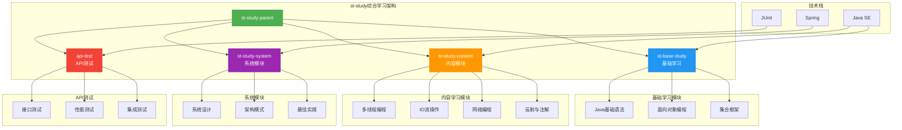

# st-study-parent

> 📚 Java综合学习项目

本项目是一个综合性的Java学习项目，包含基础学习、系统学习和API测试等多个模块。

## 📊 项目架构图

```mermaid
graph TB
    subgraph "st-study综合学习架构"
        A[st-study-parent] --> B[st-base-study<br/>基础学习]
        A --> C[st-study-content<br/>内容模块]
        A --> D[st-study-system<br/>系统模块]
        A --> E[api-test<br/>API测试]
    end
    
    subgraph "基础学习模块"
        B --> F[Java基础语法]
        B --> G[面向对象编程]
        B --> H[集合框架]
    end
    
    subgraph "内容学习模块"
        C --> I[多线程编程]
        C --> J[IO流操作]
        C --> K[网络编程]
        C --> L[反射与注解]
    end
    
    subgraph "系统模块"
        D --> M[系统设计]
        D --> N[架构模式]
        D --> O[最佳实践]
    end
    
    subgraph "API测试"
        E --> P[接口测试]
        E --> Q[性能测试]
        E --> R[集成测试]
    end
    
    subgraph "技术栈"
        S[Java SE] --> B
        S --> C
        T[Spring] --> D
        U[JUnit] --> E
    end
    
    style A fill:#4CAF50,stroke:#2E7D32,color:#fff
    style B fill:#2196F3,stroke:#1565C0,color:#fff
    style C fill:#FF9800,stroke:#F57C00,color:#fff
    style D fill:#9C27B0,stroke:#6A1B9A,color:#fff
    style E fill:#F44336,stroke:#C62828,color:#fff
```
